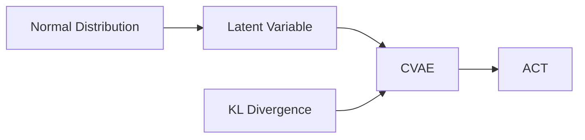

# Mathematics

<NoteMeta status="Learning" difficulty="Foundation" updated="2026-09" />

数学不是需要先“学完”才能进入模型的前置关卡。这里从真实模型里遇到的问题出发，再回到概率、分布、距离与优化。

## 当前主题

- [Normal Distribution](/mathematics/normal-distribution)
- [KL Divergence](/mathematics/kl-divergence)

## 与 ACT 的连接

