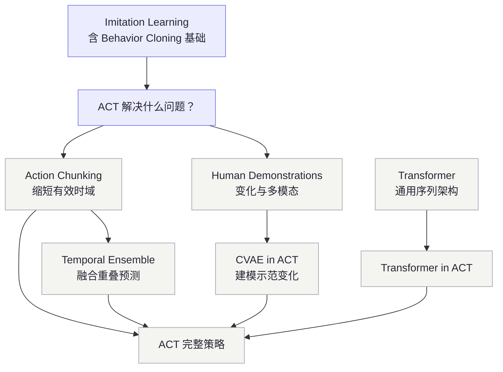

# ACT · Action Chunking with Transformers

<NoteMeta />

ACT 是本站第一条正式建设的知识链。这个专题不从网络层数开始，而是依次回答：论文面对什么问题、每个设计为何出现、数学对象是什么，以及训练和推理时数据怎样流动。

::: info 内容状态
目前只有第一篇问题导论完成了原论文核对并标记为 `reviewed`。其余子页面仍是 `seed/learning` 内容，后续会逐篇重写，不能作为事实来源。
:::

## ACT 的最小依赖图

理解 ACT overview 真正必需的前置知识很少。Transformer 和 CVAE 是理解实现细节的依赖，不是进入第一篇文章的门槛。

### 为什么图没有继续无限展开

- 阅读“ACT 为什么出现”只要求知道模仿学习与 Behavior Cloning 的基本问题。
- 深入 Transformer 时才需要 Attention、Q/K/V、Softmax 和位置编码。
- 深入 CVAE 时才需要 VAE、潜变量、正态分布、重参数化和 KL Divergence。
- 深入 Temporal Ensemble 时才需要加权平均。

这些二级依赖属于各自 canonical page，不应全部变成 ACT overview 的阅读门槛。

## 当前阅读顺序

1. **[ACT：它到底解决什么问题？](/robot-learning/act/why-action-chunking)** — `reviewed`，正式入口。
2. [Temporal Ensemble in ACT](/robot-learning/act/temporal-ensemble) — `learning`，理解闭环执行。
3. [Transformer in ACT](/robot-learning/act/transformer) — `learning`，理解多视角信息与动作序列如何建模。
4. [CVAE 与 latent z in ACT](/robot-learning/act/cvae) — `learning`，理解训练时如何处理人类示范变化。

## Canonical 与 application 的边界

- [Transformer](/deep-learning/transformer) 是通用概念的 canonical page；本专题的 Transformer 页面只解释它在 ACT 中的输入、cross-attention 与输出。
- ACT 中的 CVAE 页面目前是 application page。通用 CVAE canonical page 会在正式阅读 CVAE 原始工作后再建立。
- Action Chunking 和 Temporal Ensemble 是否成为独立 canonical page，要在相应内容重写时根据知识边界决定，不提前制造占位页。

## Primary Source

Tony Z. Zhao, Vikash Kumar, Sergey Levine, and Chelsea Finn. **Learning Fine-Grained Bimanual Manipulation with Low-Cost Hardware.** *Robotics: Science and Systems*, 2023. [RSS proceedings PDF](https://www.roboticsproceedings.org/rss19/p016.pdf)

