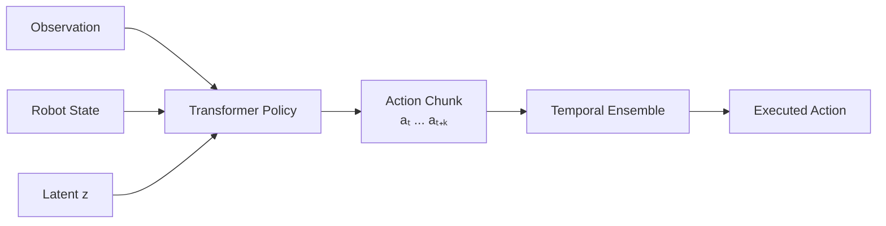

# ACT · Action Chunking with Transformers

<NoteMeta status="Learning" difficulty="Intermediate" updated="2026-09" />

ACT 是本站第一个完整知识专题。目标不是只记住网络结构，而是回答每个组件为什么存在，以及它怎样改变机器人策略的行为。

## 核心结构

## 学习顺序

1. [为什么机器人需要 Action Chunking](/robot-learning/act/why-action-chunking)
2. [Transformer 在 ACT 中做什么](/robot-learning/act/transformer)
3. [为什么需要 CVAE 与 latent z](/robot-learning/act/cvae)
4. [Temporal Ensemble](/robot-learning/act/temporal-ensemble)

## 这个专题将回答

- 为什么单步 Behavior Cloning 容易积累误差？
- Action Chunking 如何改变预测问题？
- 同一个观测可能对应多个合理动作时，CVAE 怎样表示这种多样性？
- 为什么训练时学习 $z$，推理时可以令 $z=0$？
- 多个重叠 action chunk 如何组合成最终动作？

::: info 学习中的笔记
这里的内容会随阅读论文、复现代码和实验持续修正。`Learning` 表示它是可读的工作笔记，而不是最终定稿。
:::

