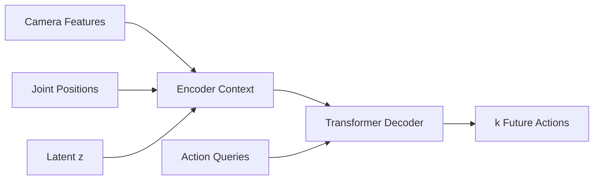

# Transformer 在 ACT 中做什么？

<NoteMeta />

## 先给结论

Transformer 在 ACT 中承担两个核心任务：把图像、机器人状态和 latent $z$ 组织成上下文；让一组 action queries 从上下文中共同解码出动作 chunk。

## 为什么适合动作序列

Attention 允许每个 action query 根据任务上下文读取不同信息，也允许多个未来动作在共享表示下被联合建模。这里重要的不是“Transformer 属于 NLP”，而是它提供了一种灵活的序列关系建模机制。

## 待验证的问题

- 不同 ACT 实现中 encoder / decoder token 的具体组织方式
- action query 的数量与 chunk size 的关系
- 视觉 backbone 输出如何进入 Transformer
