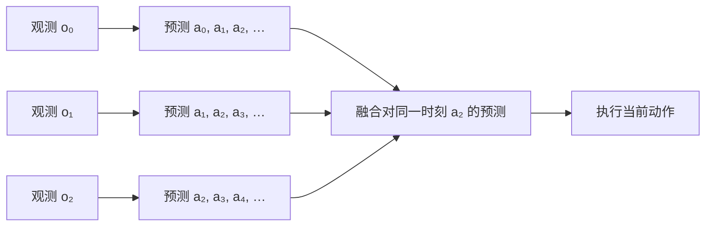

# ACT：它到底解决什么问题？

<NoteMeta />

ACT 的核心并不是“给机器人换上 Transformer”。它首先是在回答一个更具体的问题：

> 只有一批离线的人类示范时，怎样让低成本、精度有限的机器人，仍能稳定完成长时间、需要毫米级精度和闭环视觉反馈的双臂操作？

原论文认为，这类任务把模仿学习的两个困难放大了：**策略误差会沿时间累积**，而**人类示范本身又不是干净、唯一的动作答案**。Action Chunking、Temporal Ensembling 和 CVAE 分别针对这两个困难；Transformer 则是实现序列建模的架构。

::: info 本文怎样标注信息
“论文事实”只表示 ACT 原论文明确写出或实验报告的内容；“数学推论”表示从定义可以推出的结果；“直觉”用于建立 mental model，不代替定义或实验结论。
:::

## 阅读前只需要知道什么

只要知道[模仿学习（Imitation Learning）](/robot-learning/imitation-learning)的基本问题就可以继续：给定专家示范中的观测与动作，训练一个策略去模仿专家。Transformer、CVAE 和 KL Divergence 都不是理解本文问题定义的前提；它们在深入 ACT 的实现时才需要。

## 1. 论文研究的不是普通抓取

::: info 论文事实 · Abstract 与 Section I
ACT 出自论文 *Learning Fine-Grained Bimanual Manipulation with Low-Cost Hardware*。这篇工作同时提出了低成本双臂遥操作系统 ALOHA 和学习算法 ACT；ACT 只是整套工作的算法部分。
:::

论文关心的是 fine-grained manipulation：插入电池、打开透明调料杯、穿过魔术贴环等精细操作。它们不只要求“最终位置大致正确”，还要求机器人在接触、形变和遮挡不断发生时，持续根据视觉修正动作。论文指出，几毫米误差就可能导致任务失败。

这使问题具有三个同时存在的特征：

1. **轨迹长**：真实任务由数百个高频控制步组成。
2. **反馈强**：当前动作会改变物体、接触关系和下一时刻观测。
3. **容错低**：一次很小的偏差就可能把后续操作带到完全不同的状态。

::: tip 直觉 · 拉拉链
把拉开密封袋想成“找到袋身 → 捏住滑块 → 沿正确方向拉开”。如果第二步偏了几毫米，第三步面对的就不再是同一个问题。后面的策略不能只把前面的误差当成一点随机噪声；它看到的整个场景已经改变。
:::

## 2. 单步 Behavior Cloning 为什么会越来越难

设一条长度为 $T$ 的示范轨迹为

$$
\tau = (o_1,a_1,o_2,a_2,\ldots,o_T,a_T),
$$

其中：

- $o_t$ 是时刻 $t$ 的观测，例如相机图像和机器人关节位置；
- $a_t$ 是专家在该时刻给出的动作；在 ACT 论文中，它是双臂下一时刻的目标关节位置；
- $T$ 是整条轨迹包含的控制步数。

最直接的 Behavior Cloning 学习单步策略

$$
\pi_\theta(a_t \mid o_t),
$$

即根据当前观测 $o_t$ 预测下一步动作 $a_t$。参数 $\theta$ 在专家数据上通过监督学习得到。

问题在于：训练时的 $o_t$ 来自专家走过的轨迹；部署时的下一观测却由机器人自己刚刚执行的动作共同决定。如果预测产生误差，机器人可能进入专家数据很少覆盖的状态；策略在陌生状态上更容易继续犯错。

```text
小的动作误差
→ 环境进入偏移后的状态
→ 下一观测离开训练分布
→ 下一次预测更不可靠
→ 偏移继续扩大
```

::: info 论文事实 · Section I、II 与 IV
原论文把这称为 compounding errors，并将其列为高精度模仿学习的主要困难。ACT 选择从“缩短有效时域”的方向缓解它，而不是要求额外的在线专家纠正。
:::

这里的关键不是“单步预测一定失败”。关键是当任务长、动作高频、状态对误差敏感时，策略需要连续做出大量相互影响的预测，误差暴露的机会随之增加。

## 3. 人类示范也不是唯一、平稳的标签

即使机器人两次看到近似相同的观测，人也可能用不同但都合理的轨迹完成任务。人在不要求高精度的阶段可能快一点、慢一点或短暂停顿；在交接胶带等动作中，每次交接位置也会变化。

::: info 论文事实 · Section IV-B 与 V-B
论文将人类示范描述为 noisy、stochastic，并包含 multi-modal behavior。它还在 Action Chunking 的讨论中用示范中的停顿说明 temporally correlated confounders：动作有时不只取决于当前状态，也与轨迹所处的时间结构有关。
:::

对单步策略来说，这意味着同一个 $o_t$ 附近可能出现多个不同的 $a_t$。只把每个时刻看成独立的输入—标签对，会丢掉“这些动作属于同一段行为”的信息。

::: tip 直觉 · 不要把多条路线平均成一条路
绕过障碍物时，从左绕和从右绕都可能正确；逐点平均却可能正好撞上障碍物。这个例子只是帮助理解“多种合理未来”的风险，不是 ACT 论文中的实验场景。
:::

## 4. 第一步：把预测单位从一个动作改成一段动作

ACT 不只预测 $a_t$，而是预测长度为 $k$ 的动作块：

$$
A_t = (a_t,a_{t+1},\ldots,a_{t+k-1}),
$$

并学习

$$
\pi_\theta(A_t \mid o_t).
$$

这里 $A_t$ 是从时刻 $t$ 开始的一段动作，$k$ 是 chunk size。论文正文写作 $\pi_\theta(a_{t:t+k}\mid s_t)$；这里用 $k$ 个元素的显式定义，避免切片端点的歧义。

### 4.1 它怎样改变有效时域

如果把一条 $T$ 步轨迹看成由长度为 $k$ 的行为单元组成，那么单元数量近似为

$$
H_{\text{effective}} \approx \left\lceil \frac{T}{k} \right\rceil.
$$

其中 $H_{\text{effective}}$ 是按 chunk 计算的有效时域，$\lceil\cdot\rceil$ 表示向上取整。

::: info 论文事实 · Section IV-A
论文将这一变化表述为有效时域缩短约 $k$ 倍。它的目标是缓解长、高频轨迹中的 compounding errors，并让一个 chunk 内的动作共同表达一段连贯行为。
:::

::: warning 数学推论的边界

$\lceil T/k\rceil$ 描述的是把轨迹按行为块理解时的预测结构，不等于 ACT 部署时只观察环境 $\lceil T/k\rceil$ 次。正式推理会在每个 timestep 重新查询策略。
:::

### 4.2 为什么不能无限增大 $k$

更大的 $k$ 会缩短有效时域，但也要求模型从当前观测预测更远的未来。极端情况下，若一次生成整条轨迹，策略就接近 open-loop control，很难及时利用新观测纠错。

::: info 论文事实 · Section VI-A、Figure 9(a)
在关闭 Temporal Ensembling 的四个仿真设置汇总中，论文报告成功率从 $k=1$ 时的 1% 上升到 $k=100$ 时的 44%，随后在 $k=200,400$ 略有下降。论文把下降归因于反应性不足以及长动作序列更难建模。因此证据支持“存在合适的中间尺度”，不支持“chunk 越长越好”。
:::

## 5. 第二步：每一步重算，并融合重叠预测

如果每隔 $k$ 步才读取一次新观测，机器人会在 chunk 边界突然切换计划，运动可能不平滑。ACT 的实际推理不是这样做的：它在**每个 timestep** 都根据最新观测预测一个新 chunk。

于是，同一个未来时刻 $t$ 会收到来自不同历史时刻的多份预测。Temporal Ensembling 对这些“都指向时刻 $t$”的动作做指数加权平均，再执行融合后的当前动作。



::: info 论文事实 · Section IV-A、Figure 6 与 Algorithm 2
论文强调，这不是把相邻时刻已经执行的动作做平滑，而是聚合同一目标时刻的多份预测。它不增加训练开销，但会增加推理计算。
:::

这一步在逻辑上同时保留了两件事：chunk 提供一段动作的时间结构；每步查询又让策略持续接收闭环反馈。详见 [Temporal Ensemble in ACT](/robot-learning/act/temporal-ensemble)。

## 6. 第三步：把人类动作序列当成条件生成问题

Action Chunking 决定“预测什么”，但还没有解决“同一观测可能对应多种合理动作序列”。ACT 因此把 chunk policy 训练成 CVAE：给定当前观测，通过潜变量 $z$ 表示示范动作序列中的变化。

训练时，CVAE encoder 读取机器人本体状态和示范 action sequence，得到 $z$ 的分布；policy 再根据图像、关节位置和 $z$ 重建动作序列。测试时 encoder 被丢弃，论文令 $z=0$，也就是使用先验分布的均值进行确定性解码。

::: info 论文事实 · Section IV-B、Figure 5 与 Algorithms 1–2
论文用 CVAE objective 训练策略，以建模 noisy human demonstrations。Figure 9(c) 的仿真汇总显示：移除 CVAE 对确定性的 scripted data 几乎没有影响，但在人类示范数据上，成功率从 35.3% 降到 2%。这个结果支持 CVAE 对该论文的人类数据很重要，不等于证明所有模仿学习数据都必须使用 CVAE。
:::

CVAE 在 ACT 中的具体输入、loss 与推理方式，留在 [CVAE 与 latent z in ACT](/robot-learning/act/cvae) 中展开。

## 7. Transformer 到底处在什么位置

ACT 使用 Transformer encoder 与 decoder 来汇聚多视角图像、关节状态和 $z$，并生成动作序列。这正是名称中 “with Transformers” 的来源。

但从问题—方法关系看：

- compounding errors 对应的核心设计是 Action Chunking；
- chunk 边界和重叠预测对应 Temporal Ensembling；
- 人类示范的变化与多模态对应 CVAE objective；
- Transformer 是承载这些序列输入输出的具体架构。

所以“ACT 有效，因为 Transformer 很强”并不是原论文给出的完整因果解释。想理解通用架构可读 [Transformer canonical page](/deep-learning/transformer)；想看论文中的具体数据流可读 [Transformer in ACT](/robot-learning/act/transformer)。

## 8. 实验证据说明了什么，也没有说明什么

论文在两个仿真任务和六个真实任务上评估 ACT。真实任务每项通常收集 50 条成功示范，Thread Velcro 收集 100 条，对应每个任务约 10–20 分钟的示范数据。

| 真实任务 | ACT 最终成功率 |
| --- | ---: |
| Slide Ziploc | 88% |
| Slot Battery | 96% |
| Open Cup | 84% |
| Thread Velcro | 20% |
| Prep Tape | 64% |
| Put On Shoe | 92% |

这些数字来自论文 Tables II–III。Slide Ziploc 和 Slot Battery 与四种 baseline 做了比较；其余四项真实任务只与其中表现最好的 BeT 比较。结果支持 ACT 在论文设置中的优势，并不证明任意机器人、任意任务或任意数据规模下都能得到同样结果。20% 的 Thread Velcro 结果也提醒我们：感知困难与毫米级插入仍然会成为瓶颈。

Temporal Ensembling 的消融同样需要克制解读：论文报告它让 ACT 的汇总成功率提高 3.3 个百分点，让 BC-ConvMLP 提高 4 个百分点，却让非参数方法 VINN 下降 20 个百分点。它是 ACT 的有效组成，不是对任何模型都成立的通用增益。

## 9. 常见误解

### 误解一：ACT 预测 $k$ 个动作后就闭眼执行 $k$ 步

不完整。Action Chunking 的概念动机确实按块预测；ACT 的实际推理却每步生成一个新 chunk，再用 Temporal Ensembling 融合重叠预测。

### 误解二：ACT 主要解决的是“Transformer 不够会控制机器人”

不对。论文先提出 compounding errors 和非平稳的人类示范，再用 Action Chunking、Temporal Ensembling 与 CVAE 应对；Transformer 是实现序列模型的架构选择。

### 误解三：chunk 越长，误差累积就一定越少，所以越长越好

不对。更长 chunk 会减少有效时域，也会降低反应性并增加长序列建模难度。论文消融在中间的 $k=100$ 达到峰值，接近完全 open-loop 时反而回落。

### 误解四：CVAE 的目标是在测试时随机生成很多动作风格

不符合论文的实际推理。训练阶段用 $z$ 表示示范变化；测试阶段论文固定 $z=0$，得到确定性输出。

## 如果只记住一件事

> ACT 把高频、长时域的逐步模仿问题，改写成“根据最新观测预测一段连贯动作，并在每一步融合重叠预测”的问题；再用 CVAE 处理人类示范中的变化。Transformer 负责实现这个序列模型，但不是问题定义本身。

## Related Concepts

- [Imitation Learning](/robot-learning/imitation-learning)：理解训练分布与部署分布为什么会分离。
- [Transformer](/deep-learning/transformer)：通用 canonical page。
- [CVAE 与 latent z in ACT](/robot-learning/act/cvae)：ACT 如何建模人类示范。
- [Temporal Ensemble in ACT](/robot-learning/act/temporal-ensemble)：重叠 chunks 怎样产生当前动作。

## Next Step

下一步自然的问题是：Action Chunking 产生的多份重叠预测，如何在不混淆时间索引的前提下合成一个当前动作？继续阅读 [Temporal Ensemble in ACT](/robot-learning/act/temporal-ensemble)。

## Primary Source

Tony Z. Zhao, Vikash Kumar, Sergey Levine, and Chelsea Finn. **Learning Fine-Grained Bimanual Manipulation with Low-Cost Hardware.** *Robotics: Science and Systems*, 2023. [RSS proceedings PDF](https://www.roboticsproceedings.org/rss19/p016.pdf) · [arXiv record](https://arxiv.org/abs/2304.13705) · [official project page](https://tonyzhaozh.github.io/aloha/)

本文主要核对 Abstract、Sections I–II、IV–VII、Figures 5–6、Figure 9、Algorithms 1–2 以及 Tables II–III。
