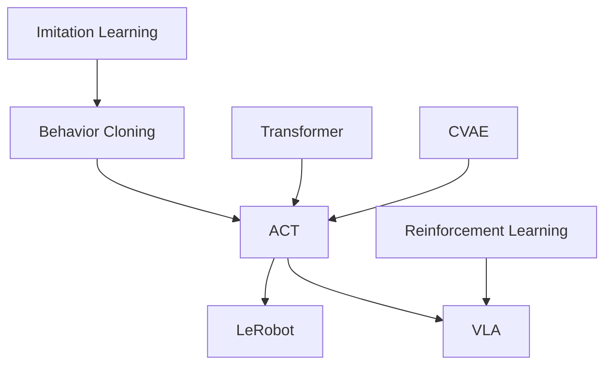

# Robot Learning

<NoteMeta status="Learning" difficulty="Current Focus" updated="2026-09" />

Robot Learning 研究如何让机器人从数据和交互中获得策略，而不只是依赖手写控制规则。

## 学习地图

## 当前专题

### [ACT · Action Chunking with Transformers](/robot-learning/act/)

为什么一次预测一段动作能够缓解机器人模仿学习中的误差累积？Transformer、CVAE 和 temporal ensemble 在这里分别解决什么问题？

## 下一步

- [Imitation Learning](/robot-learning/imitation-learning)
- LeRobot
- Vision-Language-Action Models
- Reinforcement Learning

